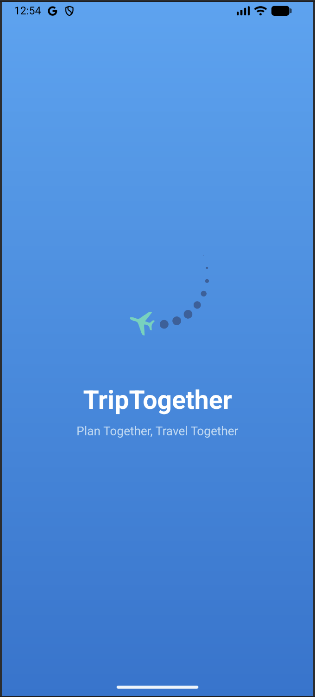
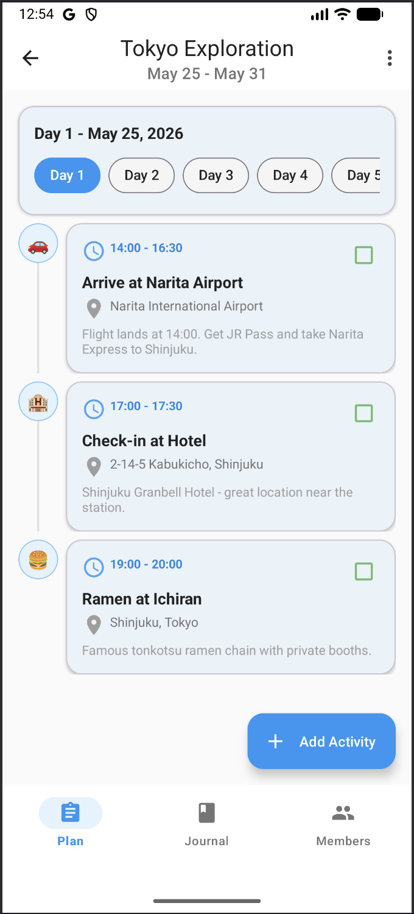
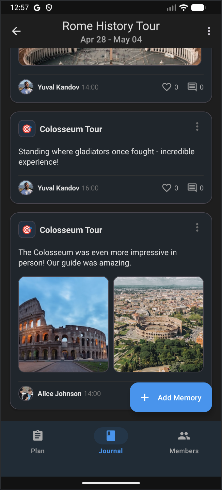

<p align="center">
  
</p>

# TripTogether

A collaborative trip-planning Android app. Multiple users join the same trip with a 6-character invite code, then together build a day-by-day plan of activities and capture memories with photos. Everything syncs across all members in real time.

Built as a final project for the UI Development course at Afeka College.

## Screenshots

| Plan a trip together | Capture memories together |
|:---:|:---:|
|  |  |

## Features

- Email and Google sign-in
- Create trips with cover photos and date ranges
- Invite others with a 6-character code
- Day-by-day activity timeline with categories (food, transport, hotel, activity, other)
- Mark activities as completed
- Memory journal with photos, text, likes, and comments
- Real-time sync across all members of a trip
- Dark mode toggle

## Tech Stack

- **Language:** Kotlin
- **Min SDK:** 26 (Android 8.0) · **Target SDK:** 36
- **UI:** View Binding, Material Components 3, Edge-to-Edge
- **Architecture:** Activities + Fragments, RecyclerView with adapters, singleton managers
- **Backend:** Firebase
    - Authentication (Email + Google via FirebaseUI)
    - Realtime Database (all app data)
    - Storage (cover photos, memory photos)
- **Image loading:** Glide
- **Animations:** Lottie

## Project Structure

```
com.example.triptogether/
├── (root)        Activities (full screens: Splash, Login, Main, TripDetail, etc.)
├── ui/           Fragments and dialog fragments (Plan, Members, Journal, etc.)
├── adapters/     RecyclerView adapters for each list
├── model/        Data classes (Trip, TripActivity, Memory, TripMember, ...)
├── interfaces/   Callback interfaces for adapter → fragment communication
└── utilities/    Singletons and helpers (FirebaseManager, StorageManager, ...)
```

## Firebase Data Model

```
users/{userId}                       → user profile
trips/{tripId}                       → trip data
  └── members/{userId}               → trip members (nested)
activities/{tripId}/{activityId}     → grouped by trip
memories/{activityId}/{memoryId}     → grouped by activity
likes/{memoryId}/{userId}            → one node per liking user
comments/{memoryId}/{commentId}      → comments per memory
inviteCodes/{code}: tripId           → reverse lookup for joining
```

Invite codes are stored in a separate top-level node as a reverse-lookup table - looking up a code returns the trip ID directly in O(1), instead of scanning every trip.

## Getting Started

> **Note:** `google-services.json` is intentionally not included in this repository. You will need to create your own Firebase project and generate this file before the app will build.

1. Clone the repository
2. Open the project in Android Studio (Giraffe or newer recommended)
3. Set up a Firebase project at [console.firebase.google.com](https://console.firebase.google.com):
    - Create a new project
    - Add an Android app with the package name **`com.example.triptogether`**
    - Download the generated `google-services.json` and place it in the **`app/`** folder of this project
    - Under **Authentication**, enable the **Email/Password** and **Google** sign-in providers
    - Create a **Realtime Database** (start in test mode for development)
    - Enable **Firebase Storage** (start in test mode for development)
4. Sync Gradle and run on a device or emulator (API 26+)

## Key Design Choices

- **Singleton managers** (`FirebaseManager`, `StorageManager`, `ImageLoader`, `SignalManager`) initialized once in a custom `Application` class, so the rest of the app accesses them via `getInstance()`.
- **Builder pattern + public no-arg constructor** on every model. The no-arg constructor is required by Firebase for deserialization; the Builder makes construction with many fields readable.
- **All Firebase access funneled through `FirebaseManager`** - Activities and Fragments never touch the database directly. This keeps paths centralized and makes the rest of the code easier to read.
- **One Activity hosts multiple Fragments** for the trip detail screen (Plan / Members / Journal tabs), all sharing the same `tripId` - cheaper than three separate Activities.
- **Listeners are removed in `onDestroyView`** to avoid memory leaks from long-lived Firebase callbacks.

## Author

Yuval Kandov - Afeka College of Engineering
